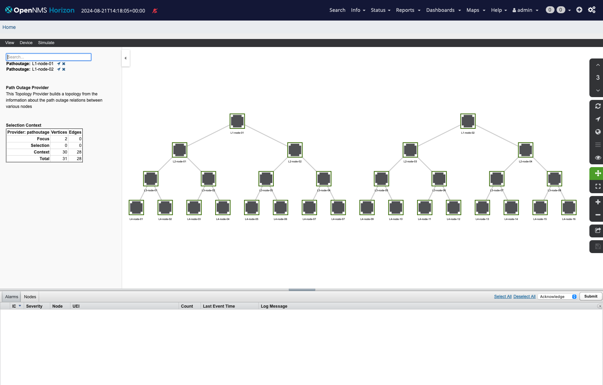

# Event Forwarding Playground

This is a playground which provisions nodes in a 4 layer hiearchy using the Node parent functionality.

The path outage topology is modeled as the following:



Clone the repository and start the stack with the following command:

```
cd event-forwarding
docker compose up -d
```

Provision the nodes with inventory in the init directory:

```
cd init
./import.sh
```
