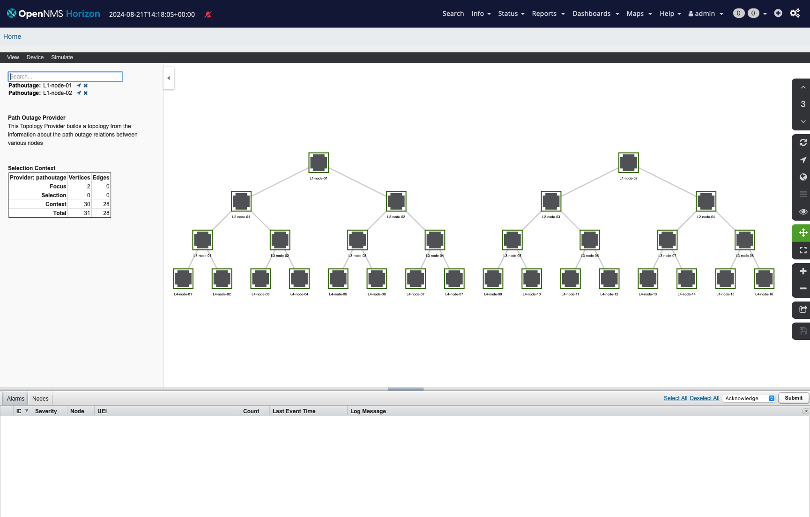

# Kafka Integration Playground

This is a playground which provisions nodes in a 4 layer hierarchy using the Node parent functionality.
With the provisioning there is also a Kafka broker in the topology which can be used to play with upstream integration using Kafka.
The Core instance has the Kafka Producer and Consumer plugin configured.

For testing an integration, Events, Alarms, Metrics, Node inventory and topology updates are forwarded to dedicated topics.
The topic configuration is defined in the [Kafka Producer configuration](container-fs/core-etc-overlay/org.opennms.features.kafka.producer.cfg).

The path outage topology is modeled as the following:



Clone the repository and start the stack with the following command:

```
cd kafka-integration
docker compose up -d
```

Provision the nodes with inventory in the init directory:

```
cd init
./import.sh
```
